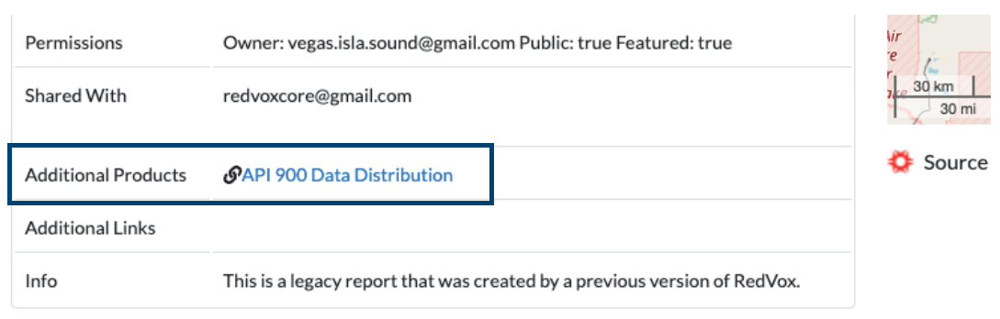

Download the Skyfall data from RedVox
=========================================

The Skyfall dataset is stored in the `RedVox Report '3f3f' <https://redvox.io/#/reports/3f3f>`_.
Next to *Additional Products*, you will find a link to download the data. Click over *API 900 Data Distribution*.

A zip file starting with *aa* will start to download. Unzip the file, inside the folder there will be two folders: *api900*
and *reports*. The folder *api900* contains the raw data (files ending with ``.rdvxz``) extracted from the phone and
*reports* contains a figure from the report.

The next step is to clone the Skyfall Github repository and :doc:`install`.