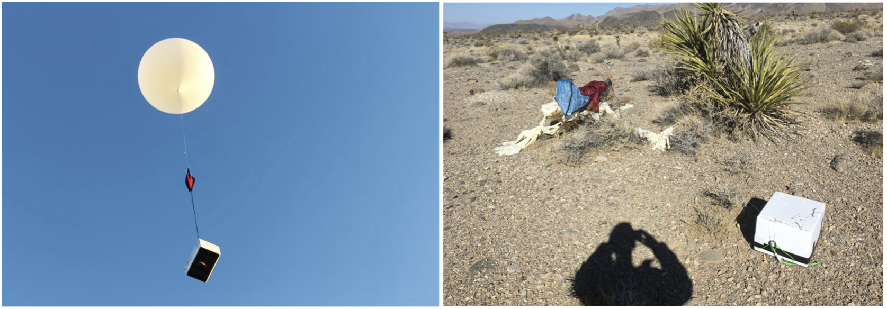

Skyfall: Signal Fusion from a Smartphone Falling from the Stratosphere
====================================================================================

**Skyfall** is a high-quality dataset that showcases the `RedVox SDK <https://github.com/RedVoxInc/redvox-python-sdk>`_
and the `RedPandas library <https://github.com/RedVoxInc/redpandas>`_ for processing smartphone data collected
with the `RedVox Infrasound Recorder app <https://www.redvoxsound.com/>`_.

**What is Skyfall?**

In essence, Skyfall is an event where a smartphone fell from a high altitude and landed on the ground. A balloon hoisted a commercial, off-the-shelf, smartphone to a height of 36 km (around 119,000 feet) and purposely burst
to let the smartphone freefall (hence the name *Skyfall*). As the smartphone fell back to Earth, it recorded its 30 minute
descent using the app.

   *Left*. A meteorological balloon carrying infrasound sensors in a PolarTech insulated shipping
   container in 2015. The Skyfall set-up is very similar to the one shown and described here.

   *Right*. Landing site,
   with payload box flipped upside down on the lower right and the parachute (blue and red) tangled with balloon
   shreds in the upper left.

.. note::

   You can read more about the Skyfall project in the published paper:
   `Skyfall: Signal Fusion from a Smartphone Falling from the Stratosphere <https://www.mdpi.com/2624-6120/3/2/14/>`_.

Contents
--------

.. toctree::

   getting-started/index
   running-skyfall/index

