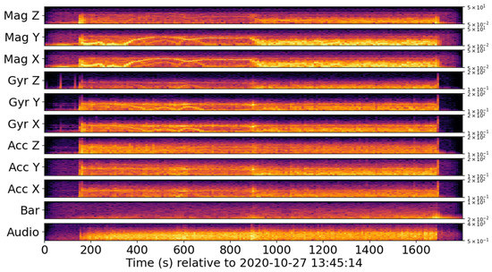

Run the code
=================

Now that all the set-up is complete, you are ready to run the Skyfall example!

Introduction: skyfall_intro.py
-------------------------------

Run the file ``skyfall_intro.py`` (view in `code in Github <https://github.com/RedVoxInc/Skyfall/blob/main/skyfall_intro.py>`_).

``skyfall_intro.py`` extracts the API 900 RedVox data and plots Time-Domain Representation of the different sensors
available as the phone descended from the Stratosphere. A graph plotted in ``skyfall_intro.py`` is shown below.

.. figure:: ../../img/wiggles.png
   :scale: 65%
   :alt: wiggles

   High-pass filtered (hp) waveforms for sensors: audio, barometer (Bar), accelerometer
   (Acc), gyroscope (Gyr), and magnetometer (Mag). X-Y-Z coordinates are shown vertical axes are normalized to the peak absolute magnitude of each channel.
   Figure 17. High-pass filtered (hp) waveforms for sensors: audio, barometer (Bar), accelerometer
   (Acc), gyroscope (Gyr), and magnetometer (Mag).

More scripts
-------------

The *lib* folder (view in `Github <https://github.com/RedVoxInc/Skyfall/tree/main/lib>`_) contains various scripts that examine different aspects of the data.
In order:

* ``run_all.py``: run all the scripts in the *lib* folder
* ``skyfall_dw``: create a `RedVox DataWindow <https://github.com/RedVoxInc/redvox-python-sdk/tree/master/docs/python_sdk/data_window#datawindow>`_ that is used to load the RedVox data in ``run_all.py``
* ``skyfall_ensonify.py``: ensonify the Skyfall dataset to a *.wav* file so you can listen to it
* ``skyfall_export.py``: export the Skyfall dataset into a *.parquet* for later use
* ``skyfall_gravity.py``: examine the accelerometer gravity waveforms
* ``skyfall_loc_rpd.py``: extract the location data from the bounder to make a CSV (in the *bounder* folder)
* ``skyfall_spinning.py``: examine the gyroscope to understand how the phone spun as it fell
* ``skyfall_station_specs.py``: export station specs to CSV
* ``skyfall_tdr_rpd.py``: plot Time-Domain Representations (run in ``skyfall_intro.py``)
* ``skyfall_tfr_rpd.py``: plot Time-Frequency Representations

An example of a spectrogram plotted in ``skyfall_tfr_rpd.py``:

   Short-term Fourier transforms of high-pass filtered (hp) waveforms for sensors: audio, barometer (Bar), accelerometer (Acc), gyroscope (Gyr), and magnetometer (Mag). The color scales
   barometer (Bar), accelerometer (Acc), gyroscope (Gyr), and magnetometer (Mag). The color scales to
   to the maximum amplitude. The vertical axes represent logarithmic frequency in hertz to the sensor
   the maximum amplitude.

What to do next?
----------------

Here are a few suggestions if you are interested in learning more about Skyfall and RedVox:

* Read more about Skyfall in `Skyfall: Signal Fusion from a Smartphone Falling from the Stratosphere <https://www.mdpi.com/2624-6120/3/2/14/>`_.

* Read more about the `RedVox SDK <https://github.com/RedVoxInc/redvox-python-sdk>`_ used to load the RedVox phone data.

* Read more about `RedPandas <https://github.com/RedVoxInc/redpandas>`_ used to process the RedVox data.

